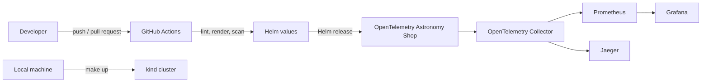

# Astronomy Shop: Local DevSecOps Platform

A cloud-free, DevOps platform for the maintained [OpenTelemetry Astronomy Shop](https://github.com/open-telemetry/opentelemetry-demo). It deploys a realistic microservice application to a local **kind** Kubernetes cluster using the upstream OpenTelemetry Helm chart, with repeatable validation, security scanning, observability, and operational runbooks.

> This repository manages the platform around the application. It deliberately does **not** fork or modify Astronomy Shop application source code.

## What this demonstrates

- Kubernetes delivery using Helm and a pinned upstream chart version
- Local, reproducible clusters with kind — no AWS account or credit card required
- CI validation: Helm rendering, Kubernetes schema validation, and IaC misconfiguration scanning
- Supply-chain hygiene: a locked chart version, SBOM generation for platform files, and scheduled dependency checks
- Observability through the application's OpenTelemetry Collector, Prometheus, Grafana, Jaeger, and feature-flag services
- A practical operational workflow: health verification, rollback, failure triage, and clean teardown

## Architecture



## Prerequisites

- Docker Desktop running
- `kind` v0.23 or newer
- `kubectl` v1.29 or newer
- Helm v3.14 or newer
- GNU Make (Git Bash or WSL on Windows)

No cloud credentials are needed.

## Quick start

```bash
make bootstrap
make up
make status
```

Open the storefront and observability UIs:

```bash
make port-forward
```

- Storefront: http://localhost:8080
- Grafana: http://localhost:8080/grafana/
- Jaeger: http://localhost:8080/jaeger/ui/

Stop port-forwarding with `Ctrl+C`. Remove every local resource when finished:

```bash
make down
```

## Safe delivery model

The chart version is pinned in [platform/helm/versions.env](platform/helm/versions.env). Do not use `latest`. Update it intentionally, run `make validate`, review the rendered manifests, and then deploy. The upstream project owns application images; this repository owns the deployment configuration and platform controls.

## Commands

| Command | Purpose |
| --- | --- |
| `make bootstrap` | Create the kind cluster and add the Helm repository. |
| `make validate` | Render and validate Kubernetes manifests locally. |
| `make scan` | Scan platform configuration for misconfigurations. |
| `make up` | Install or upgrade the Astronomy Shop release. |
| `make status` | Show release and workload readiness. |
| `make port-forward` | Expose the storefront, Grafana, and Jaeger locally. |
| `make rollback` | Roll back to the previous Helm revision. |
| `make down` | Delete the kind cluster. |

## Interview walkthrough

1. Explain why this uses kind: reproducible Kubernetes practice with zero cloud cost.
2. Run `make validate` to demonstrate shift-left checks.
3. Run `make up`, then `make status`.
4. Use Grafana and Jaeger to follow a request across services.
5. Delete a non-critical pod, show Kubernetes recovery, and use [the runbook](docs/runbooks/frontend-unavailable.md) to explain the investigation.
6. Finish with `make down` to prove clean resource lifecycle management.

## Scope and limitations

This is a learning platform, not a production deployment. It intentionally excludes cloud IAM, public ingress, persistent production data, and production alert delivery. Those are documented as future work in [docs/roadmap.md](docs/roadmap.md), rather than being claimed as implemented.
