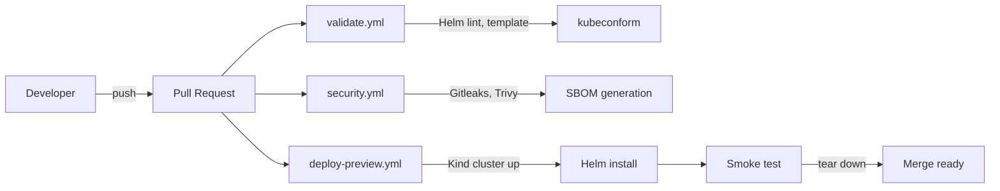
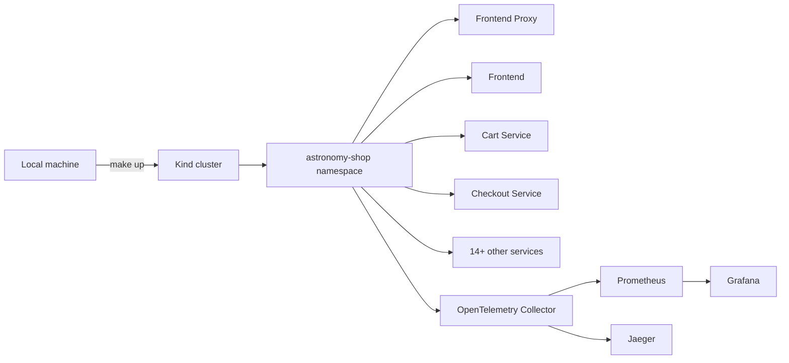

# Astronomy Shop -- Local DevSecOps Platform

[](https://github.com/letsconfuse/shop-devops/actions/workflows/validate.yml)
[](https://github.com/letsconfuse/shop-devops/actions/workflows/deploy-preview.yml)
[](https://github.com/letsconfuse/shop-devops/actions/workflows/security.yml)
[](LICENSE)

A production-style DevOps platform built around the [OpenTelemetry Astronomy Shop](https://github.com/open-telemetry/opentelemetry-demo), a realistic microservices application with 15+ services written in Go, Python, Java, .NET, Node.js, and Rust. This repository manages the entire deployment lifecycle -- CI validation, security scanning, ephemeral testing environments, and observability -- targeting a **local Kubernetes cluster** with zero cloud cost.

> This repository manages the **platform around the application**. It does not fork or modify the Astronomy Shop source code. The upstream Helm chart version is pinned in [`platform/helm/versions.env`](platform/helm/versions.env) and upgraded intentionally.

---

## Architecture

Every pull request triggers a multi-stage pipeline that validates configuration, scans for vulnerabilities, deploys to an ephemeral Kubernetes cluster, and runs smoke tests against the live application -- all before code reaches the main branch.

### CI Pipeline



### Runtime



---

## Security Pipeline

Security is enforced as a CI gate, not an afterthought. The [`security.yml`](.github/workflows/security.yml) workflow runs four layers of scanning on every pull request:

| Layer | Tool | What It Catches | Behavior |
|---|---|---|---|
| Secret Detection | Gitleaks | API keys, passwords, tokens in git history | Blocks merge |
| IaC Config Scan | Trivy (config mode) | Kubernetes misconfigurations (privileged containers, missing resource limits) | Blocks merge |
| Image Vulnerability Scan | Trivy (image mode) | CVEs in third-party container images | Logs findings |
| Supply Chain Inventory | Syft (SBOM) | Generates a Software Bill of Materials artifact | Informational |

The decision to log (not block) on upstream image CVEs is documented in [ADR-0003](docs/adr/0003-security-scanning-strategy.md). Blocking on vulnerabilities in images we do not build or maintain would make CI permanently red without giving us an actionable fix.

---

## CI Workflows

Each workflow has a single responsibility:

| Workflow | Trigger | Purpose |
|---|---|---|
| [`validate.yml`](.github/workflows/validate.yml) | PR, push to main | Helm lint, Helm template rendering, kubeconform schema validation |
| [`deploy-preview.yml`](.github/workflows/deploy-preview.yml) | PR | Spin up a Kind cluster, deploy the full application via Helm, run smoke tests, tear down |
| [`security.yml`](.github/workflows/security.yml) | PR, push to main | Gitleaks, Trivy config scan, Trivy image scan, SBOM generation |

Workflows are built on **reusable composite actions** to keep the YAML minimal and DRY:

| Action | Purpose |
|---|---|
| [`setup-helm`](.github/actions/setup-helm/action.yml) | Install Helm and add the OpenTelemetry chart repository |
| [`setup-kind`](.github/actions/setup-kind/action.yml) | Install Kind |
| [`setup-kubectl`](.github/actions/setup-kubectl/action.yml) | Install kubectl |
| [`setup-kubeconform`](.github/actions/setup-kubeconform/action.yml) | Install kubeconform |
| [`helm-render`](.github/actions/helm-render/action.yml) | Pull, lint, and template the Helm chart |

---

## Local Cloud Strategy

This project runs entirely on your local machine. No AWS account, no credit card, no cloud billing surprises.

| Production Equivalent | Local Replacement | Why |
|---|---|---|
| EKS / GKE / AKS | **Kind** (Kubernetes in Docker) | Full Kubernetes API, runs inside Docker, free |
| S3 | MinIO (Tier 2) | S3-compatible API for artifact storage |
| RDS (Postgres) | Postgres container (Tier 2) | Standard database for stateful services |
| SQS / SNS / Secrets Manager | LocalStack (Tier 2) | Emulates AWS APIs locally |
| ALB / Route53 | ingress-nginx (Tier 2) | Demonstrates ingress without cloud load balancers |

**What would change on real AWS:** IAM roles replace LocalStack's permissive defaults, VPC networking replaces Docker's flat network, ACM certificates replace self-signed TLS, and EKS node groups replace Kind's Docker containers. See the relevant ADRs for detailed gap analysis.

---

## Quick Start

### Prerequisites

- Docker Desktop (running)
- `kind` v0.23+
- `kubectl` v1.29+
- Helm v3.14+
- GNU Make

No cloud credentials are needed.

### Deploy

```bash
make bootstrap    # Create Kind cluster, add Helm repos
make up           # Deploy the full Astronomy Shop
make status       # Verify all pods are running
make port-forward # Expose the application locally
```

Then open:

- **Storefront:** <http://localhost:8080>
- **Grafana:** <http://localhost:8080/grafana/>
- **Jaeger:** <http://localhost:8080/jaeger/ui/>

Tear everything down:

```bash
make down
```

### All Commands

| Command | Purpose |
|---|---|
| `make bootstrap` | Create the Kind cluster and add the Helm repository |
| `make validate` | Render and validate Kubernetes manifests locally |
| `make scan` | Scan platform configuration for misconfigurations |
| `make up` | Install or upgrade the Astronomy Shop release |
| `make status` | Show release and workload readiness |
| `make port-forward` | Expose the storefront, Grafana, and Jaeger locally |
| `make rollback` | Roll back to the previous Helm revision |
| `make down` | Delete the Kind cluster and all resources |

---

## Repository Structure

```text
shop-devops/
├── .github/
│   ├── actions/                 # Reusable composite actions (setup-helm, setup-kind, etc.)
│   └── workflows/               # CI pipelines (validate, deploy-preview, security)
├── docs/
│   ├── adr/                     # Architecture Decision Records
│   ├── runbooks/                # Operational troubleshooting guides
│   ├── journey.md               # Engineering journal
│   └── roadmap.md               # Phased build plan
├── platform/
│   ├── helm/                    # Helm values overrides and pinned chart version
│   └── kind/                    # Kind cluster configuration
├── tests/
│   └── smoke/                   # Smoke test scripts for ephemeral deployments
├── Makefile                     # Developer workflow automation
└── README.md
```

---

## Architecture Decision Records

Every non-obvious technical decision is documented with context, alternatives considered, and tradeoffs:

| ADR | Decision |
|---|---|
| [ADR-0001](docs/adr/0001-ci-validation-strategy.md) | CI validation strategy -- why kubeconform, why composite actions |
| [ADR-0002](docs/adr/0002-ephemeral-environments-and-smoke-testing.md) | Ephemeral environments -- why Kind in CI, why smoke tests over full E2E |
| [ADR-0003](docs/adr/0003-security-scanning-strategy.md) | Security scanning -- why Gitleaks, why Trivy, how we handle upstream CVEs |

---

## Roadmap

This project is built in sequenced phases. Each phase is fully working and documented before the next begins.

### Completed

| Phase | Scope | Key Deliverables |
|---|---|---|
| Phase 0 | Repository hygiene | EditorConfig, pre-commit, yamllint, markdownlint, shellcheck, actionlint |
| Phase 1 | Validation pipeline | Helm lint, Helm template, kubeconform, composite actions |
| Phase 2 | Ephemeral deploy and smoke test | Kind cluster in CI, Helm deploy, HTTP smoke test, auto-teardown |
| Phase 3 | Security basics | Gitleaks, Trivy (config + image), SBOM generation |

### Planned

| Phase | Scope | Key Deliverables |
|---|---|---|
| Phase 4 | GitOps with Argo CD | Git-driven deployments, sync status checks, auto-reconciliation |
| Phase 5 | Observability stack | Prometheus, Grafana, OpenTelemetry Collector, dashboards, alert rules |
| Phase 6 | Terraform and advanced security | Declarative infra provisioning, Checkov, Cosign, SLSA |

---

## Safe Delivery Model

The Helm chart version is pinned in [`platform/helm/versions.env`](platform/helm/versions.env). The project never uses `latest`. Upgrades follow this process:

1. Review the upstream release notes
2. Update the version pin on a feature branch
3. `make validate` to render and diff the manifests
4. Open a pull request -- CI validates, scans, and deploys to an ephemeral cluster
5. Merge only after all checks pass

---

## Scope and Limitations

This is a local development platform, not a production deployment. It intentionally excludes:

- Cloud IAM and RBAC (replaced by Kind's permissive auth)
- Public ingress and TLS termination (replaced by `kubectl port-forward`)
- Persistent production data and backup strategies
- Production alert delivery (PagerDuty, Slack)
- Multi-environment promotion (dev, staging, production)

**What I would change on real AWS:** Replace Kind with EKS, add ALB Ingress Controller with Route53, use ACM for TLS, add IRSA for pod-level IAM, configure VPC with private subnets, use S3 + DynamoDB for Terraform remote state, and set up GitHub OIDC to eliminate long-lived credentials in CI.
