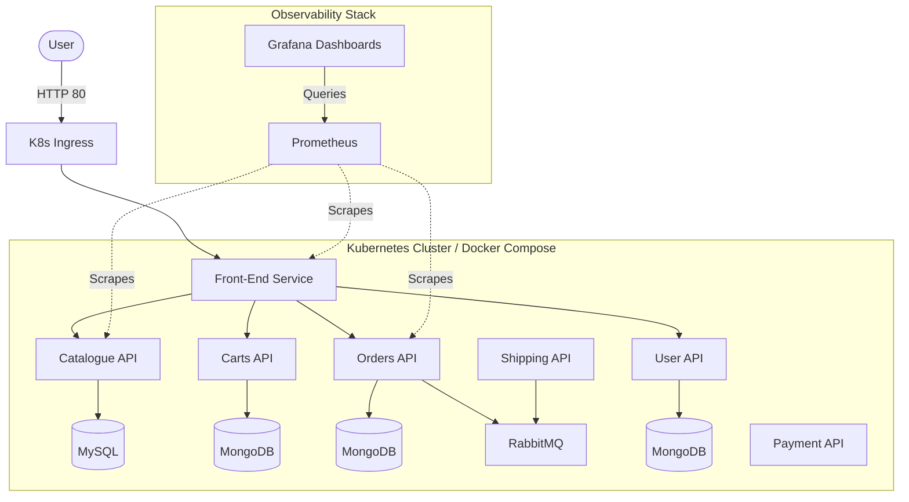

# Cloud-Native Sock Shop: End-to-End DevOps Deployment

[](.github/workflows/ci.yml)
[](terraform/main.tf)
[](kubernetes/)
[](monitoring/)

> GitHub: [github.com/letsconfuse](https://github.com/letsconfuse)

A production-grade, end-to-end DevOps deployment of the **Weaveworks Sock Shop** microservices architecture. This project serves as a comprehensive portfolio piece demonstrating modern Cloud-Native practices: from containerization and local orchestration to automated CI/CD, GitOps-style Kubernetes deployments, Infrastructure as Code (AWS), and a full Observability stack.

---

## System Architecture



---

## Technology Stack

| Domain | Technology | Implementation Details |
|---|---|---|
| **Containerization** | Docker | Multi-stage builds, non-root users (`appuser`) for security. |
| **Local Environment** | Docker Compose | Custom `docker-compose.yml` networking 13+ microservices. |
| **CI/CD Pipelines** | GitHub Actions | Automated Linting (`hadolint`, `yamllint`), Testing, and Docker pushes. |
| **Orchestration** | Kubernetes | Deployments (`RollingUpdate`), Services, Ingress, Secrets, ConfigMaps. |
| **Infra as Code (IaC)** | Terraform | AWS EC2 provisioning with S3 Remote State backend. |
| **Automated Testing** | Bruno / Playwright | API Smoke tests run automatically as a pre-deployment gate. |
| **Observability** | Prometheus & Grafana | Custom SLI alerts (`FrontEndDown`) and auto-provisioned dashboards. |

---

## How to Run Locally

You can spin up the entire microservice ecosystem and the observability stack on your local machine using Docker Compose.

1. **Clone the repository**:
   ```bash
   git clone https://github.com/letsconfuse/sock-shop-devops.git
   cd sock-shop-devops
   ```
2. **Start the application**:
   ```bash
   docker-compose -f docker/docker-compose.yml up -d
   ```
3. **Access the Application & Tools**:
   - **Storefront**: `http://localhost:8079`
   - **Grafana Dashboard**: `http://localhost:3000` (Pre-configured)
   - **Prometheus**: `http://localhost:9090`

*To tear down the environment:* `docker-compose -f docker/docker-compose.yml down`

---

## CI/CD & Delivery Flow

The project utilizes two distinct GitHub Actions workflows to ensure code quality and seamless delivery:

1. **Continuous Integration (PRs to `main`)**
   - Triggers `hadolint` for Dockerfiles and `yamllint` for manifests.
   - Builds the custom `front-end` Docker image.
   - Spins up ephemeral `docker-compose` containers and runs **Bruno API Smoke Tests**.

2. **Continuous Deployment (Merges to `main`)**
   - Repeats the CI checks to guarantee integrity.
   - Securely pushes the image to Docker Hub tagged with the Git SHA.
   - Injects the AWS `KUBE_CONFIG` via GitHub Secrets to trigger a GitOps-style `kubectl apply` and a zero-downtime Rolling Update to the cluster.

---

## Infrastructure & Kubernetes

- **Terraform (`terraform/`)**: Fully automates the provisioning of the underlying AWS infrastructure. Uses an S3 bucket with DynamoDB state locking to simulate a team environment safely. 
- **Kubernetes (`kubernetes/`)**: Core application components are mapped to dedicated manifests. Sensitive data like database credentials are decoupled using Kubernetes `Secret` resources, while environment variables are passed via `ConfigMap`.

---

## Architectural Decisions & Learnings

To see a detailed log of *why* certain technical choices were made (e.g., why CI and CD are separated, or why the front-end Dockerfile was rewritten from scratch), please read the **[Decision Log (docs/decisions.md)](docs/decisions.md)**.
