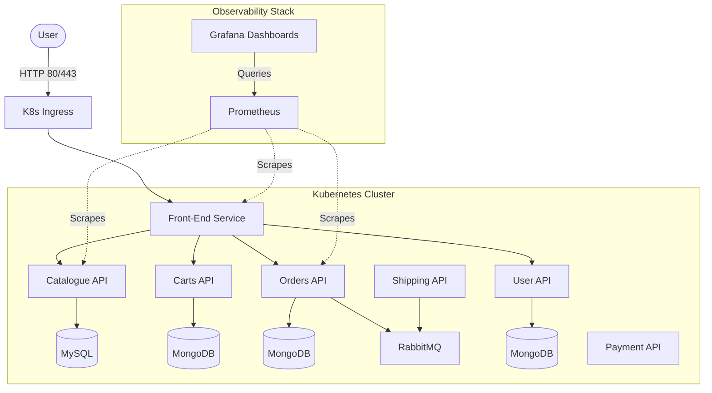

# Cloud-Native Sock Shop: End-to-End DevOps Deployment

[](.github/workflows/ci.yml)
[](terraform/main.tf)
[](kubernetes/)
[](monitoring/)

> GitHub: [github.com/letsconfuse](https://github.com/letsconfuse)

A production-grade, end-to-end DevOps deployment of the **Weaveworks Sock Shop** microservices architecture. This project demonstrates modern cloud-native practices with enhanced security, robustness, and automated CI/CD workflows.

---

## System Architecture



---

## Technology Stack

| Domain | Technology | Implementation Details |
|---|---|---|
| **Containerization** | Docker | Multi-stage builds, non-root users (`appuser`) for security. |
| **Local Environment** | Docker Compose | Custom `docker-compose.yml` networking 13+ microservices. |
| **CI/CD Pipelines** | GitHub Actions | Automated Linting (`hadolint`, `yamllint`), Testing, and Docker pushes. |
| **Orchestration** | Kubernetes | Deployments with RollingUpdate, health checks, Pod Disruption Budget, Network Policies. |
| **Infra as Code (IaC)** | Terraform | AWS VPC, EC2 provisioning, security hardening, S3 Remote State backend with DynamoDB locking. |
| **Automated Testing** | Bruno / Curl | API smoke tests and health verification in CI/CD pipeline. |
| **Observability** | Prometheus & Grafana | Metrics scraping, custom dashboards, and alert rules for critical services. |

---

## Security Features

### AWS Infrastructure
- Dedicated VPC with private subnets for network isolation
- Restricted security groups: SSH limited to specific IP ranges, Kubernetes API internal-only
- IMDSv2 enforcement to prevent metadata exploitation
- EBS volumes encrypted with AWS KMS
- Elastic IP for stable public access

### Kubernetes Security
- Network policies implementing zero-trust networking (deny-all by default)
- RBAC with minimal privilege service accounts and role bindings
- Security contexts enforcing non-root users, dropped Linux capabilities, read-only filesystems
- Pod Disruption Budgets maintaining availability during cluster maintenance

---

## Production Robustness

- Resource limits and requests prevent resource exhaustion
- Liveness and readiness probes for container health monitoring
- Pod anti-affinity rules spread replicas across nodes
- Rolling update strategy with zero downtime (maxUnavailable: 0)
- Health checks integrated into CI/CD pipeline

---

## How to Run Locally

You can spin up the entire microservice ecosystem and the observability stack on your local machine using Docker Compose.

1. Clone the repository:
   ```bash
   git clone https://github.com/letsconfuse/sock-shop-devops.git
   cd sock-shop-devops
   ```

2. Start the application:
   ```bash
   docker-compose -f docker/docker-compose.yml up -d
   ```

3. Access the applications:
   - Storefront: `http://localhost:8079`
   - Grafana Dashboard: `http://localhost:3000` (credentials: admin/admin)
   - Prometheus: `http://localhost:9090`

To tear down the environment:
```bash
docker-compose -f docker/docker-compose.yml down
```

---

## CI/CD & Delivery Flow

The project utilizes three GitHub Actions workflows to ensure code quality and safe delivery:

### Continuous Integration (Pull Requests to main)
File: `.github/workflows/ci.yml`

Triggered on pull requests, this workflow:
- Lints YAML files with `yamllint`
- Lints Dockerfiles with `hadolint`
- Builds the custom front-end Docker image
- Spins up ephemeral Docker Compose containers
- Performs health checks on key services
- Runs API smoke tests

### Continuous Deployment (Merges to main)
File: `.github/workflows/cd.yml`

Triggered on commits to main, this workflow:
- Runs all CI checks to guarantee code integrity
- Builds and pushes the image to Docker Hub with Git SHA tag
- Authenticates with the Kubernetes cluster
- Applies all Kubernetes manifests
- Updates front-end deployment with the new image
- Monitors rollout status

### Terraform Validation
File: `.github/workflows/terraform-validate.yml`

Triggered on pull requests modifying Terraform files:
- Validates Terraform format with `terraform fmt`
- Validates syntax with `terraform validate`
- Checks best practices with `tflint`

---

## Infrastructure & Kubernetes

### Terraform (terraform/)
Fully automates AWS infrastructure provisioning:
- VPC with public subnets and Internet Gateway
- EC2 instance with Ubuntu 22.04 for Kubernetes runtime
- Security groups with restricted inbound rules
- Encrypted EBS volumes for data protection
- S3 backend with DynamoDB for state locking (supports team environments)

Key variables:
- `aws_region` (default: us-east-1)
- `instance_type` (default: t3.medium)
- `key_name` - SSH key pair for EC2 access
- `allowed_ssh_cidrs` - Restrict SSH to specific IP ranges

### Kubernetes (kubernetes/)

Core application components organized into dedicated manifests:
- **Deployments**: Enhanced with resource limits, health checks, and security contexts
- **Services**: Expose microservices within the cluster
- **ConfigMaps**: Manage application configuration
- **Secrets**: Handle sensitive data (database credentials)
- **Network Policies**: Implement zero-trust networking
- **RBAC**: Define minimal privilege access controls

### Monitoring (monitoring/)
- **Prometheus**: Scrapes metrics from services with 15-second intervals
- **Grafana**: Pre-configured dashboards for visualization
- **Alert Rules**: Custom alerts for critical service failures

---

## Deployment to AWS

### Prerequisites
- AWS account with credentials configured
- Terraform 1.0 or later
- kubectl 1.27 or later
- Docker Hub account for image pushes

### Setup Steps

1. Configure Terraform variables:
   ```bash
   cd terraform/
   cp terraform.tfvars.example terraform.tfvars
   # Edit terraform.tfvars with your values
   ```

2. Deploy infrastructure:
   ```bash
   terraform init
   terraform plan
   terraform apply
   ```

3. Connect to the instance:
   ```bash
   ssh -i your-key.pem ubuntu@<public_ip>
   ```

4. Initialize Kubernetes:
   ```bash
   minikube start --driver=docker
   ```

5. Deploy applications:
   ```bash
   kubectl apply -f kubernetes/deployments/
   kubectl apply -f kubernetes/services/
   kubectl apply -f kubernetes/configmaps/
   kubectl apply -f kubernetes/network-policies/
   kubectl apply -f kubernetes/rbac/
   ```

6. Configure GitHub Secrets for CD:
   - `DOCKER_USERNAME` - Docker Hub username
   - `DOCKER_PASSWORD` - Docker Hub access token
   - `KUBE_CONFIG` - Base64-encoded kubeconfig

---

## Documentation

For detailed information about security enhancements and production best practices, see [ENHANCEMENTS.md](docs/ENHANCEMENTS.md).

This document covers:
- Security hardening details
- Resource limits and health checks configuration
- Network policy implementation
- RBAC setup
- Performance impact analysis
- Production checklist

---

## Additional Resources

- [Kubernetes Documentation](https://kubernetes.io/docs/)
- [Terraform AWS Provider](https://registry.terraform.io/providers/hashicorp/aws/)
- [Docker Security Best Practices](https://docs.docker.com/engine/security/)
- [Prometheus Documentation](https://prometheus.io/docs/)
- [Grafana Documentation](https://grafana.com/docs/)

---

## Troubleshooting

### Check pod status
```bash
kubectl get pods -n sock-shop
kubectl describe pod <pod-name> -n sock-shop
kubectl logs <pod-name> -n sock-shop
```

### Verify network connectivity
```bash
kubectl exec -it <pod-name> -n sock-shop -- sh
wget http://target-service:port/
```

### Terraform validation
```bash
cd terraform/
terraform validate
terraform fmt -check .
```

---

**Last Updated:** July 2026
